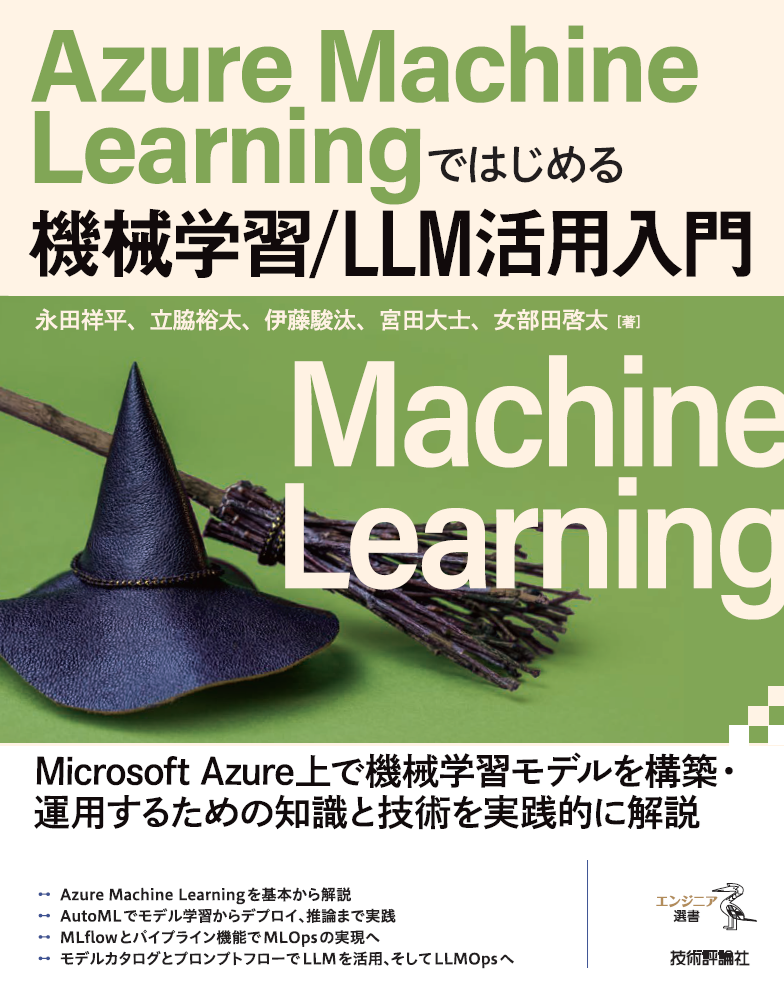

# 「Azure Machine Learning ではじめる機械学習/LLM 活用入門」サンプル

「Azure Machine Learning ではじめる機械学習/LLM 活用入門」の本文で利用しているサンプルコードです。

技術評論社: https://gihyo.jp/book/2025/978-4-297-14846-1 <br/>
Amazon: https://amzn.asia/d/0eeMaFT



## サンプルコードのダウンロード

本サンプルコードは、[Zip ファイル](https://github.com/shohei1029/book-azureml-sample/archive/refs/heads/main.zip)としてダウンロードするか、次のコマンドをターミナルで実行してください。

```bash
git clone https://github.com/shohei1029/book-azureml-sample
```

## サンプルコードの構成

| 章タイトル                                 | コードと設定ファイル |
| ------------------------------------------ | -------------------- |
| 第 1 章: 機械学習                          | なし                  |
| 第 2 章: Azure Machine Learning            | なし                  |
| 第 3 章: セットアップ                      | なし                  |
| 第 4 章: AzureML (自動機械学習)            | なし                  |
| 第 5 章:スクラッチでのモデル開発           | [ch5](./ch5)       |
| 第 6 章: MLflow による実験管理とモデル管理 | [ch6](./ch6)       |
| 第 7 章: 機械学習パイプライン              | [ch7](./ch7)       |
| 第 8 章: モデルのデプロイ                  | [ch8](./ch8)       |
| 第 9 章: MLOps                             | [ch9](./ch9)       |
| 第 10 章: 大規模言語モデル                 | なし                  |
| 第 11 章: 基盤モデルとモデルカタログ       | [ch11](./ch11)     |
| 第 12 章: プロンプトフロー                 | なし                  |
| 第 13 章: LLMOps                           | なし                  |

## 環境構築
サンプルコードを実行するにあたって、次のクライアント環境を準備する必要があります。詳しくは本書の付録 A をご参照ください。

* Azure CLI
* Azure Machine Learning用のAzure CLI拡張機能
* Azure Machine Learning Python SDK

> Azure Machine Learning のコンピューティングインスタンスをクライアントとして用いる場合はインストール済みです。


